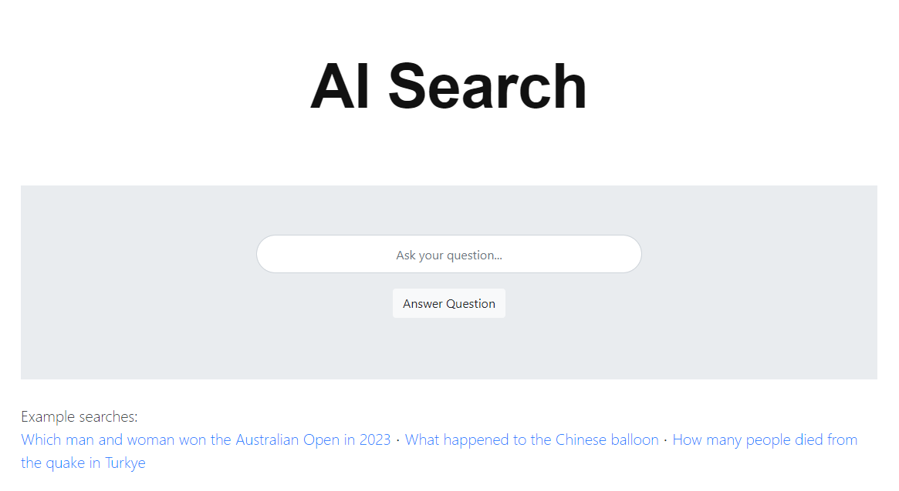
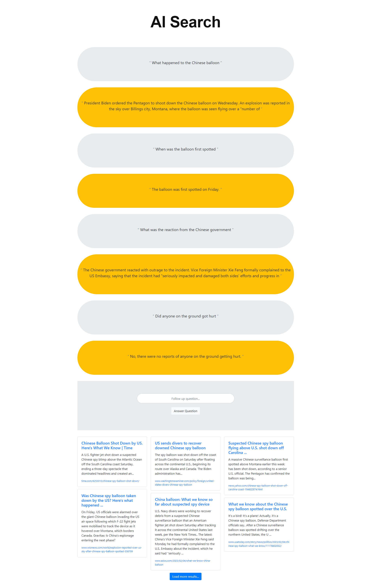
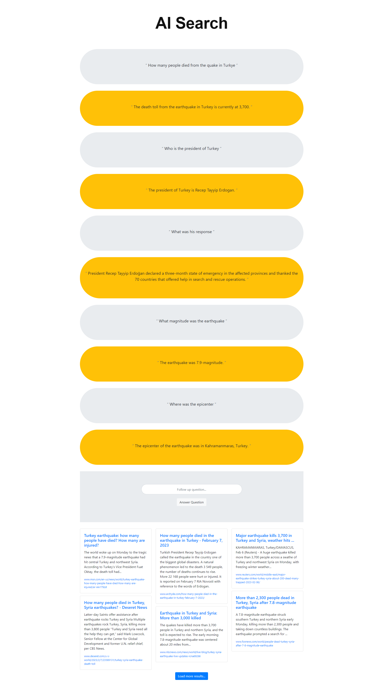
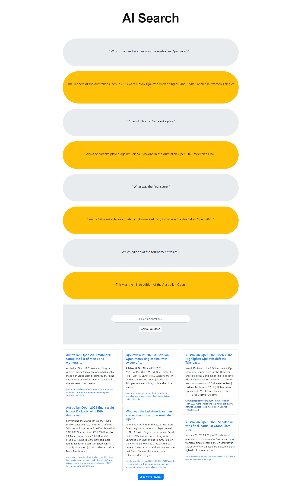

# AI Search

Prototype of using [GPT-3](https://openai.com/api/) to answer search results (provided by [DuckDuckGo](https://duckduckgo.com/)), build using [Node-RED](https://nodered.org/). This proof of concept is to show how companies like Microsoft and Alphabet can use a language model to provide users with answer to their questions based on reliable and traceble information. Users can refine their questions or ask for more details in a context-aware way. All sources that are used listed at the bottom of the page for review.

# Usage

1. Install or start an instance of [Node-RED](https://nodered.org/#get-started).
2. Import the [AI Search flow](flows.json).
3. Open the AI Search page (by default; [/api/aisearch/](http://localhost:1880/api/aisearch/).
4. Typ your search query.

# Screenshots and video

This video shows an example of a search with follow up questions:

)

## Main search page

## Search examples
| Topic | Screenshot |
| --- | --- |
| "Chinese balloon" |  |
| "Earthquake" |  |
| "Tennis" |  |

